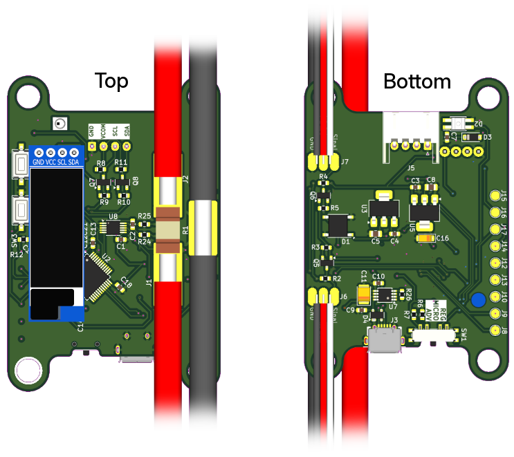

# Limitador de Potência
Dispositivo para medição de potência e consumo com controlador de limitador de potência para propulsão elétrica de Aeronaves rádio controladas.

# Configurador

Aplicativo para visualização de daods e ajustes da malha de controle.

# Hardware
Utiliza MCU STM32L052C6T, pinagem:

| PIN | Periférico | Descrição |
|---|---|---|
| PA1 | IO output | LED RGB para indicação de status  |
| PA5 | PWM Input, TIMER2 CH1 | Sinal PWM de entrada do Receptor|
|PA6 | ADC input 6 | Chave seletora de 3 estágios (indicar qual setpoint deve utilizar) |
|PA7 | PWM Ouput, TIMER22 CH2 | Saída PWM para ESC|
| PB6 | I²C SCL, Client | Comunicação com periféricos |
| PB7 | I²C SDA, Client | Comunicação com periféricos |
| PB10 | I²C SCL, Server | Servir dados para sistemas externos |
| PB11 | I²C SDA, Server | Servir dados para sistemas externos |
|PA11 | USB D- | USB|
|PA12 | USB D+ | USB |

## Periféricos
- INA226 I²C , endereço = 0b1000000
- SK6812 Mini RGB LED, protocolo WS2812B
- Display OLED SSD1306 128x32 pixels

# Firmware

Metas:

* Executar limitação de potência regulando sinal PWM utilizando mensurações do INA226 e uma malha de controle.
* Fornecer Potência, Tensão, Corrente, Energia Consumida e sinais PWMs tanto pelo I²C em modo server como pela porta USB.
* Permitir, com proteção por senha, a configuração da malha de controle PID do limitador, via porta USB.
* Suportar bootloader com assinatura de firmware.

