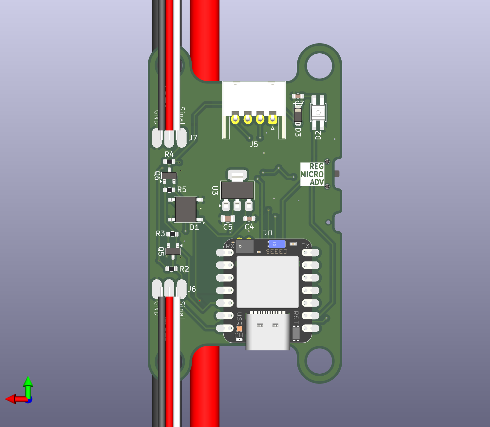
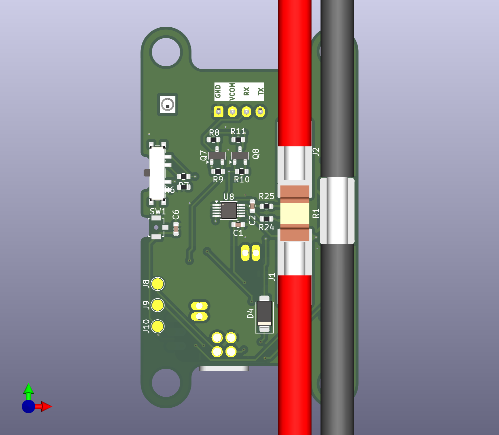

# Limitador de Potência
Dispositivo para medição de potência e consumo com controlador de limitador de potência para propulsão elétrica de Aeronaves rádio controladas.

# Configurador

Aplicativo para visualização de daods e ajustes da malha de controle.

# Hardware
Utiliza MCU nrf52 (xiao ble), com os seguintes periféricos:

| Periférico | Descrição |
|---|---|
| INA226 | Leitor de corrente, tensão e potência, R shunt de 50mOhms |
| SK6812mini | Led rgba para indicão de status |
| Saída PWM | com BSS138 para ajuste de nível lógico em 5Vdc |
| Entrada PWM | com BSS138 para ajuste de nível lógico para 3.3Vdc |
| Saída UART | 115200 bps, saída de dados em tempo real do control | 
| BLE | Transmissão de informações me tempo real via BLE |

# Firmware

Metas:

* Executar limitação de potência regulando sinal PWM utilizando mensurações do INA226 e uma malha de controle to tipo ADRC.
* Fornecer Potência, Tensão, Corrente, Energia Consumida e sinais PWMs (entrada, controle e saída) pela porta UART.
* Permitir a configuração de número de idenficação e ajuste da malha de controle pela porta USB.
* Através de comunicação bluetooth BLE, transmitir tempo total ligado em segundos, potência máxima, número de identificação e acumulado de energia consumida.
* Suportar bootloader com assinatura de firmware.

# Futuro

Adicionar um monitor de células da bateria: https://www.analog.com/media/en/technical-documentation/data-sheets/ltc6810-1-6810-2.pdf

