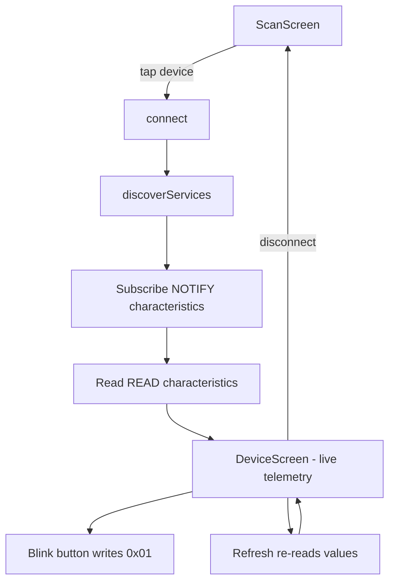

# PM100 Power Limiter — Flutter BLE App

A Flutter + Dart mobile app that connects to the **PM100 Power Limiter** over
Bluetooth Low Energy (BLE), displays live telemetry, and sends a "blink" command
to the device.

- **Stack:** Flutter (Dart), `flutter_blue_plus`
- **Platforms:** Android, iOS
- **Device:** PM100 Power Limiter (Seeed Studio Xiao BLE, Zephyr-based firmware)

---

## Features

- Scan for nearby BLE devices and connect to the PM100.
- Secure pairing via MITM passkey (the device requires encryption on all GATT
  characteristics; the OS shows the numeric PIN prompt automatically).
- Subscribe to `NOTIFY` characteristics for live telemetry updates.
- Read `READ`-only characteristics (Uptime, Team Name, Team Number) on connect
  and via a manual refresh button.
- Send the **White Blink** command (`0x01`) from a dedicated button.
- Decode and scale the raw binary payloads into human-readable values.
- Show **PWM Signals** as three 0–2000 µs progress bars.
- Light / dark theme toggle (initialized from the phone's brightness), using Android's **Material You** dynamic color (via `dynamic_color`), falling back to a seed color elsewhere.

---

## Project structure

```
lib/
  main.dart                          # App entry, theme, HomeScreen (view switch)
  models/
    pm100_spec.dart                  # UUIDs, variable definitions, value decoders
  services/
    pm100_ble_controller.dart        # BLE lifecycle + state (ChangeNotifier)
  screens/
    scan_screen.dart                 # Device discovery & connection UI
    device_screen.dart               # Telemetry list + Blink button

test/
  widget_test.dart                   # Unit tests for value formatting

android/app/src/main/AndroidManifest.xml  # BLE permissions
ios/Runner/Info.plist                      # Bluetooth usage descriptions
```

### Architecture

- `Pm100BleController` is a `ChangeNotifier` that owns the entire BLE
  lifecycle. The UI is stateless and rebuilds through a `ListenableBuilder`.
- `HomeScreen` switches between `ScanScreen` and `DeviceScreen` based on
  `controller.isReady`.



---

## BLE service specification

### Service UUID

| Item | UUID |
|---|---|
| **PM100 Service** | `E20A1A00-473B-4444-9F6D-BE083A8BD92D` |

Standard 16-bit SIG characteristics use the Bluetooth Base UUID
`0000XXXX-0000-1000-8000-00805F9B34FB`. Custom characteristics use their full
128-bit UUID.

### Characteristics

| Parameter | GATT name | UUID | Properties | Format | Size |
|---|---|---|---|---|---|
| Voltage | Voltage | `0x2B18` | `NOTIFY`, `READ` | `uint16` mV → `11.80 V` | 2 B |
| Current | Current | `0x2B17` | `NOTIFY`, `READ` | `uint16` mA → `10.20 A` | 2 B |
| Power | Power | `E20A1A08-…` | `NOTIFY`, `READ` | `uint32` mW → `600.0 W` | 4 B |
| Energy | Energy (Total) | `0x2B06` | `NOTIFY`, `READ` | `uint32` J → `450 J` | 4 B |
| Uptime | Time ms | `0x2A2B` | `NOTIFY`, `READ` | `uint32` ms → duration | 4 B |
| PWM Signals | PWM State | `E20A1A03-…` | `NOTIFY`, `READ` | 3× `uint16` µs (`IN`/`OUT`/`CTRL`) | 6 B |
| Control State | Control State | `E20A1A07-…` | `NOTIFY`, `READ` | `uint8` enum | 1 B |
| Team Name | Team Name | `E20A1A04-…` | `READ` | UTF-8, null-terminated (≤ 32 B) | ≤ 32 B |
| Team Number | Team Number | `E20A1A05-…` | `READ` | `uint32` | 4 B |
| **White Blink** | Blink Trigger | `E20A1A06-…` | `WRITE` | 1-byte `0x01` (10 blinks) | 1 B |

> All multi-byte values are **little-endian**. All characteristics require
> **encryption** (`BT_GATT_PERM_READ_ENCRYPT`).

### `ctrl_state` enum

| Value | State |
|---|---|
| `0` | `READY` |
| `1` | `LIMITING_POWER` |
| `2` | `ERROR_NO_INPUT` |
| `3` | `ERROR_NO_BATTERY` |
| `4` | `BLINK` |

Unknown values are shown as `UNKNOWN (n)`.

---

## How the app flow works

1. **Scan** — scans for all BLE devices (unfiltered, because the device name is
   dynamically composed as `team_name_team_number_MAC4`).
2. **Connect** — `connect()` skips the MTU request (`mtu: null`) since payloads
   are small.
3. **Discover** — `discoverServices()` then maps discovered characteristics to
   the spec by UUID.
4. **Subscribe** — enables notifications one characteristic at a time, with a
   short delay and a retry on `GATT_WRITE_REQUEST_BUSY`.
5. **Read** — reads the readable characteristics once for a snapshot.
6. **Live updates** — `NOTIFY` values update the UI as they arrive; the
   refresh button re-reads the `READ`-only values.

---

## Running the app

### Prerequisites

- Flutter (stable, tested on 3.47.x / Dart 3.13).
- An Android or iOS device with Bluetooth.
- The PM100 powered on and within range.

### On a physical device (recommended)

The Android emulator has **no Bluetooth adapter**, so use a physical device for
real BLE testing.

```sh
flutter pub get
flutter devices            # confirm the phone is listed
flutter run -d <device-id>
```

### Over Wi-Fi (Android wireless debugging)

1. On the phone: **Developer options → Wireless debugging → On** (same Wi-Fi as
   the PC).
2. Tap **"Pair device with pairing code"**, then on the PC:

   ```sh
   adb pair <IP:port>      # enter the 6-digit code
   adb connect <IP:port>   # the Wireless-debugging port shown on the phone
   ```

3. Confirm it appears in `flutter devices`, then `flutter run -d <device-id>`.

### Build & install only (no attached runner)

```sh
flutter build apk --debug
flutter install -d <device-id> --debug
adb -s <device-id> shell am start -n com.pm100.pm100_app/.MainActivity
```

---

## Platform configuration

- **Android** — BLE permissions are declared in
  `android/app/src/main/AndroidManifest.xml`:
  `BLUETOOTH_SCAN` / `BLUETOOTH_CONNECT` (Android 12+) plus legacy permissions.
  `flutter_blue_plus` requests them at runtime automatically.
- **iOS** — `NSBluetoothAlwaysUsageDescription` is set in
  `ios/Runner/Info.plist`.

---

## Troubleshooting

### `GATT_WRITE_REQUEST_BUSY` on connect

The Zephyr firmware processes one GATT operation at a time and returns this when
a write arrives while it is still busy. The controller mitigates it by:

- skipping the MTU request (`mtu: null`),
- separating the subscribe and read phases,
- adding delays between operations,
- retrying CCCD writes (3 attempts with backoff).

### App shows "Bluetooth not supported"

This happens on the Android emulator (no BLE hardware). Run on a physical device.

### Pin/pairing prompt

The device uses encrypted MITM pairing. The first read/subscribe triggers the OS
numeric PIN dialog — enter the 6-digit passkey configured on the device.

---

## Testing & validation

```sh
flutter analyze    # static analysis
flutter test       # unit tests for value formatting
```

Both currently pass with no issues.

---

## Notes

- `flutter_blue_plus` requires a license: this project uses `License.nonprofit`
  (personal/nonprofit/educational). For commercial use, switch to
  `License.commercial` (paid) — see the package's LICENSE. It is set in
  `lib/services/pm100_ble_controller.dart`.
